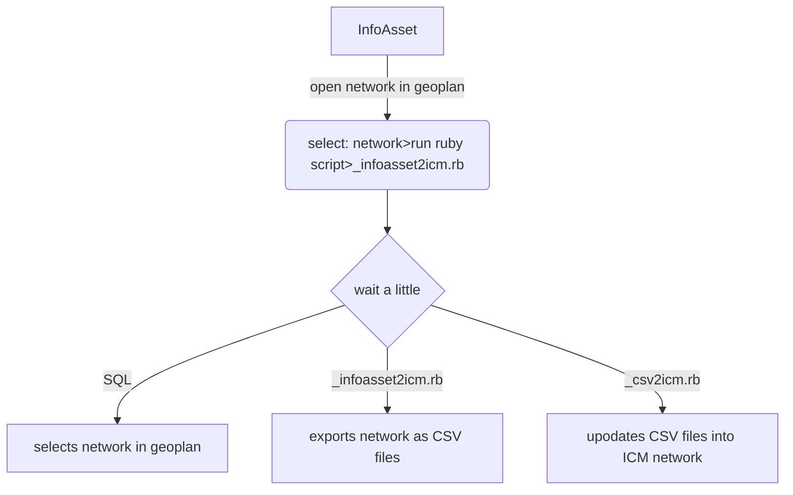

## Table of contents 

- [Purpose](#purpose)
- [Requirements](#requirements)
- [Workflow](#workflow)
- [Code](#code)
- [Recommendations](#recommendations)
- [Web](#web)
- [Contacts](#contacts)

## Applications

[](https://www.autodesk.com/nz)

## Purpose

This repository contains script and supporting files to assist in the conversion of an InfoAsset network (collection) to an Infoworks ICM network (model).

The purpose of this piece of work is to:

- remove the disconnect between the hydraulic models and asset data stored in InfoAsset
- enable a more robust model maintenance strategy for hydraulic model builds
- the intention from this point onwards is to maintain InfoAsset with the best available information such as pipe material, inverts and ground levels
- following some tidy up the base data it will then be possible to push changes such as new data/changed data and remove assets that have been deleted in InfoAsset

## Requirements

order | assumption | notes
--- | --- | ---
'1' | access to ICM Ultimate and ICM Exchange.exe | **version used: ICM 2024.5**
'2' | access to ICM Ultimate and iexchange.exe | **version used: InfoAsset 2021.8.1**
'3' | understanding on InfoAsset SQL | **good**
'4' | understanding on ICM | **good**
'5' | understading on Ruby Script | **good**

## Workflow

Currently the main Ruby script file "_infoasset2icm.rb" can be run on the active network ie the one open in the Geoplan.

On completion of the code a new network will be updated into:
- database: snumbat://10.0.29.43:40000/wastewater ongoing/system_performance
- network name='i2i network'
- network location='>other>networks>'
- network id=4765



## Code

#### Run Ruby script in network currently open in an InfoAsset Geoplan

- This ruby script is to be run on the active network in the geoplan
- The first part of the script runs an SQL on the network
- This SQL effectively selects the network thats important for the hydraulic models
- The remainder of the SQL then pushes the selected network as CSV files to a folder

##### source GIS
<p align="left">
  
</p>

```sql
/*  object type: all nodes and links
    purpose: select the network thats important 
    for the wastewater hydraulic model
*/

DESELECT ALL;

list $system = 'WWCO', 'WWPR';
list $status = 'INUS', 'REPU', 'STOK', 'END', 'VIRT';

SELECT ALL FROM [Node] IN Base SCENARIO 
WHERE MEMBER(status,$status)=TRUE AND MEMBER(system_type,$system)=TRUE;

SELECT ALL FROM [All Links] IN Base SCENARIO 
WHERE MEMBER(status,$status)=TRUE AND MEMBER(system_type,$system)=TRUE;

DESELECT ALL FROM [All Nodes] 
WHERE count(ds_links.*)=0 AND count(us_links.*)=0;
```

```ruby
# infoasset2icm.rb

# EXPORT MODEL NETWORK AS CSV AND TSV FILES

# ===========================================================================================
# parameters
folder = 'C:\Users\HLewis\Downloads\wwl-mod-ia-infoasset2icm-dev'

net=WSApplication.current_network
net.clear_selection

net.run_SQL('Node', "
	list $system = 'WWCO', 'WWPR';
	list $status = 'INUS', 'REPU', 'STOK', 'END', 'VIRT';

	SELECT ALL FROM [Node] IN Base SCENARIO
	WHERE MEMBER(status,$status)=TRUE 
	AND MEMBER(system_type,$system)=TRUE;	

	SELECT ALL FROM [All Links] IN Base SCENARIO 
	WHERE MEMBER(status,$status)=TRUE 
	AND MEMBER(system_type,$system)=TRUE;

	DESELECT ALL FROM [All Nodes] 
	WHERE count(ds_links.*)=0 AND count(us_links.*)=0;
	")

# Set up params
csv_options=Hash.new
csv_options['Use Display Precision'] = false
csv_options['Flag Fields '] = false
csv_options['Multiple Files'] = true
csv_options['Selection Only'] = true
csv_options['Coordinate Arrays Format'] = 'Packed'
csv_options['Other Arrays Format'] = 'Separate'
csv_options['WGS84'] = false
tsv_options = Hash.new
tsv_options['Export Selection'] = true

# Export CSV files
net.csv_export(folder + '\exports\csv\network.csv', csv_options)

# Export TSV files
## look through these .. later on
net.odec_export_ex('TSV', folder + '\infoasset2icm.cfg', tsv_options, 'Node', folder + '\exports\tsv\node.txt')
net.odec_export_ex('TSV', folder + '\infoasset2icm.cfg', tsv_options, 'Pump', folder + '\exports\tsv\pump.txt')
net.odec_export_ex('TSV', folder + '\infoasset2icm.cfg', tsv_options, 'Screen', folder + '\exports\tsv\screen.txt')
net.odec_export_ex('TSV', folder + '\infoasset2icm.cfg', tsv_options, 'Orifice', folder + '\exports\tsv\orifice.txt')
net.odec_export_ex('TSV', folder + '\infoasset2icm.cfg', tsv_options, 'Sluice', folder + '\exports\tsv\sluice.txt')
net.odec_export_ex('TSV', folder + '\infoasset2icm.cfg', tsv_options, 'Flume', folder + '\exports\tsv\flume.txt')
net.odec_export_ex('TSV', folder + '\infoasset2icm.cfg', tsv_options, 'Siphon', folder + '\exports\tsv\siphon.txt')
net.odec_export_ex('TSV', folder + '\infoasset2icm.cfg', tsv_options, 'Weir', folder + '\exports\tsv\weir.txt')
net.odec_export_ex('TSV', folder + '\infoasset2icm.cfg', tsv_options, 'Valve', folder + '\exports\tsv\valve.txt')

net.clear_selection

# Run the second batch file
system(folder + '\_network.bat')
```

##### config file

```sql
// Node
SELECT ANY(ds_links.pipe_type='TRNK')+ANY(us_links.pipe_type='TRNK') AS _pipe_type
SELECT MIN(ds_links.us_invert)+(MAX(ds_links.height)/1000)+0.1 AS _sealed_level
SELECT NVL(MAX(ds_links.width)/1000,MAX(us_links.width)/1000) + 0.762 AS _chamber_plan_area
```

#### Run a second Ruby script

- The final script picks up the InfoAsset exported network CSV files
- In conjunction with the InfoAsset fields it applies various lookup tables to create new fields
- the final set of data is then pushed to a network in an ICM model
- The push of data will append new rows, overwrite existing rows with changed data and delete and ones removed from InfoAsset

##### endpoint for  GIS
<p align="left">
  
</p>

The following table was used as a template for each import class

<p align="left">
  
</p>

```ruby
# IMPORT NETWORK DATA FROM CSV FILES INTO AN ICM NETWORK

## Import the 'date' library
require 'date'
WSApplication.use_arcgis_desktop_licence

## parameters
folder='C:/Users/HLewis/Downloads/wwl-mod-ia-infoasset2icm-dev/'
db=WSApplication.open('//10.0.29.43:40000/wastewater ongoing/system_performance',false)
nw = db.model_object_from_type_and_id('Model Network',4765)

## reserve network so no-one else can use it
nw.reserve

## Define a useful class
class ImportTable
	attr_accessor :tbl_format, :in_table, :cfg_file, :csv_file, :cb_class

	def initialize(tbl_format, in_table, cfg_file, csv_file, cb_class)
		@tbl_format = tbl_format
		@in_table = in_table
		@cfg_file = cfg_file
		@csv_file = csv_file
		@cb_class = cb_class
	end
end

## Attribute Conversion from InfoAsset CSV Files into InfoWorks ICM

# Callback Classes
# Node - from InfoAsset manhole

class ImporterClassNode
	def ImporterClassNode.onBeginNode(obj)
	
		@nodeTypeLookup = {		
			'ACBH' => 'manhole',    #Bore Hole  (Well / Wellhead )
			'ACCL' => 'break',    	#Chlorination Point
			'ACDP' => 'break',    	#Cable Draw Point
			'ACDW' => 'manhole',    #Dry Well 
			'ACFM' => 'manhole',    #Flowmeter Chamber
			'ACMH' => 'manhole',    #Access Chamber Manhole
			'ACOU' => 'outfall',    #wastewater outfall **NEW**
			'ACPU' => 'manhole',    #Pump Chamber
			'ACSY' => 'manhole',    #Syphon Chamber 
			#'ACVP' => 'break',    	#Vent Point
			'ACVP' => 'manhole',    #Vent Point
			'ACVU' => 'manhole',    #Vacuum Chamber / Pit
			'ACVX' => 'manhole',    #Vortex Chamber
			'ACWW' => 'manhole',    #Wet Well 
			#'BEND' => 'break',    	#Bend
			'BEND' => 'manhole',    #Bend
			'END' => 'manhole',    	#End
			'HHLD' => 'manhole',    #Household
			'INGD' => 'gully',    	#Inlet Grated Open End
			'INND' => 'gully',    	#Inlet Open End
			'JOIN' => 'manhole',    #Join
			#'LHCE' => 'break',    #Lamphole Cleaning Eye
			'LHCE' => 'manhole',    #Lamphole Cleaning Eye
			'METR' => 'break',    	#Meter
			'OTGD' => 'gully',    	#Outlet Grated Open End
			'OTND' => 'gully',    	#Outlet Open End
			'PSTN' => 'manhole',    #Pump Station
			'RGDN' => 'manhole',    #Rain Garden
			'SMP1' => 'gully',    	#Sump Single Side Entry
			'SMP2' => 'gully',    	#Sump Double Side Entry
			'SMPD' => 'gully',    	#Sump Dome
			#'TEE' => 'break',     	#Tee
			'TEE' => 'manhole',     #Tee
			'VALV' => 'break'     	#Valve
		}
	end
	
	def ImporterClassNode.onEndRecordNode(obj)
		
		# load text fields
		inNodeType = obj['node_type']
		inNodeSystemType = obj['system_type']
		inNodeChmbShape = obj['chamber_shape']

		# load float fields
		inNodeSealedFloodLevel = obj['_sealed_level'].to_f
		inNodeCoverLevel = obj['cover_level'].to_f
		inNodeChmbArea = obj['_chamber_plan_area'].to_f
		
		# load integer fields
		inTrunkType = obj['_pipe_type'].to_i
		inNodeSealed = obj['cover_locked'].to_i
		inNodeChmbDim1 = obj['chamber_dim'].to_i
		inNodeChmbDim2 = obj['chamber_dim_2'].to_i
		
		if !inNodeChmbDim1.nil?
			inNodeChmbDim1 = inNodeChmbDim1		
		end		

		if !inNodeChmbDim2.nil?
			inNodeChmbDim2 = inNodeChmbDim2			
		end	
		
		# change some fields to upper case (if necessary)
		if !inNodeType.nil?
			inNodeType = inNodeType
		end
		
		# loop through and change according to lookup list above
		if @nodeTypeLookup.has_key? inNodeType
			icmNodeNodeType = @nodeTypeLookup[inNodeType]
		else
			icmNodeNodeType = 'manhole'
		end
		
		# loop through trunk type
		if inTrunkType > 0
			icmNodeSystemType = 'combined'
		else
			icmNodeSystemType = 'foul'
		end
		
		# identify sealed manholes
		# **ADD EXTRA ONES HERE TO REPLACE BREAKS**
		if inNodeSystemType == 'WWPR'
			icmNodeFloodType = 'Sealed'
			icmNodeGroundLevel = inNodeSealedFloodLevel
		elsif inNodeSealed == 1
			icmNodeFloodType = 'Sealed'
			icmNodeGroundLevel = inNodeCoverLevel
		elsif inNodeType == 'LHCE' || inNodeType == 'ACVP' || inNodeType == 'BEND' || inNodeType == 'TEE'
			icmNodeFloodType = 'Sealed'
			icmNodeGroundLevel = inNodeCoverLevel			
		else
			icmNodeFloodType = 'Lost'
			icmNodeGroundLevel = inNodeCoverLevel
		end
		
		# chamber plan area
		if inNodeType == 'PSTN' && inNodeChmbShape == 'CIRC'
			icmChmbPlanArea = (3.14159 * ((inNodeChmbDim1/500) * (inNodeChmbDim1/500)))
		elsif inNodeType == 'PSTN' && inNodeChmbShape == 'RECT'
			icmChmbPlanArea = ((inNodeChmbDim1/1000) * (inNodeChmbDim2/1000))
		else
			icmChmbPlanArea = (3.14159/4)*(inNodeChmbArea*inNodeChmbArea)
		end
		
		# update various fields
		obj['node_type'] = icmNodeNodeType
		obj['system_type'] = icmNodeSystemType
		obj['flood_type'] = icmNodeFloodType
		obj['ground_level'] = icmNodeGroundLevel
		obj['chamber_area'] = icmChmbPlanArea
		obj['shaft_area'] = icmChmbPlanArea    # apparently its the same as the chamber area
		
	end
end

# Pipe - from InfoAsset Pipe
#
class ImporterClassPipe
	def ImporterClassPipe.onEndRecordConduit(obj)

		# load fields in a variable
		inSystemType = obj['system_type']
		inPipeType = obj['pipe_type']
		inPipeMaterial = obj['pipe_material']
		inPipeCriticality = obj['criticality'].to_f
		inPipeLength = obj['length'].to_f
		inPipeUsInvert = obj['us_invert'].to_f
		inPipeDsInvert = obj['ds_invert'].to_f
		
		# change some fields to upper case
		if !inPipeType.nil?
			inPipeType = inPipeType.upcase
		end
		
		if !inSystemType.nil?
			inSystemType = inSystemType.upcase
		end
		
		if !inPipeMaterial.nil?
			inPipeMaterial = inPipeMaterial.upcase
		end
		
		#loop through system type to generate model.system_type
		if inPipeType == 'TRNK'
			icmPipeSystemType = 'combined'
		else
			icmPipeSystemType = 'foul'
		end
		
		# loop through system type to identify pressure pipes
		if inSystemType == 'WWPR'
			icmSolutionModel = 'Pressure'
			icmUsHeadlossType = 'FIXED'
			icmDsHeadlossType = 'FIXED'
		else
			icmSolutionModel = 'Full'
			icmUsHeadlossType = 'Normal'
			icmDsHeadlossType = 'Normal'
		end
		
		# loop through main materials to derive CW roughness
		if inPipeMaterial == 'ABS'			#Acrylonitrile Butadiene Styrene
			icmPipeRoughgness = 3
		elsif inPipeMaterial == 'AC'		#Asbestos Cement
			icmPipeRoughgness = 5
		elsif inPipeMaterial == 'BRASS'		#Brass
			icmPipeRoughgness = 1
		elsif inPipeMaterial == 'BRIK'		#Brick
			icmPipeRoughgness = 6
		elsif inPipeMaterial == 'CI'		#Cast iron
			icmPipeRoughgness = 1
		elsif inPipeMaterial == 'CONC'		#concrete
			icmPipeRoughgness = 6
		elsif inPipeMaterial == 'CU'		#copper
			icmPipeRoughgness = 1
		elsif inPipeMaterial == 'DI'		#Ductile Iron (Paint Coating)
			icmPipeRoughgness = 1
		elsif inPipeMaterial == 'DICL'		#Ductile Iron Concrete Lined (Paint Coating)
			icmPipeRoughgness = 1
		elsif inPipeMaterial == 'DICLZE'	#Ductile Iron Concrete Lined ZincEpoxy Coating
			icmPipeRoughgness = 1
		elsif inPipeMaterial == 'DICLPE'	#Ductile Iron Concrete Lined PE Coated
			icmPipeRoughgness = 1
		elsif inPipeMaterial == 'DIEL'		#Ductile Iron Enamel Lined
			icmPipeRoughgness = 1
		elsif inPipeMaterial == 'DIPU'		#Ductile Iron Plastic Lined (Polyurethane)
			icmPipeRoughgness = 1
		elsif inPipeMaterial == 'EW'		#clay
			icmPipeRoughgness = 3
		elsif inPipeMaterial == 'EARTH'		#clay
			icmPipeRoughgness = 3
		elsif inPipeMaterial == 'GS'		#Galvanised Mild Steel
			icmPipeRoughgness = 1
		elsif inPipeMaterial == 'GRP'		#Glass Reinforced Plastic / Fibreglass
			icmPipeRoughgness = 1
		elsif inPipeMaterial == 'HDPE'		#High Density Polyethylene
			icmPipeRoughgness = 0.6
		elsif inPipeMaterial == 'HPPE'		#High Density Polyethylene
			icmPipeRoughgness = 0.6
		elsif inPipeMaterial == 'MDPE'		#Medium Density Polyethylene
			icmPipeRoughgness = 0.6
		elsif inPipeMaterial == 'NEOP'		#
			icmPipeRoughgness = 0.6
		elsif inPipeMaterial == 'PP'		#Polypropylene Twin Wall (BOSS)
			icmPipeRoughgness = 0.6
		elsif inPipeMaterial == 'PE'		#Polyethylene
			icmPipeRoughgness = 0.6
		elsif inPipeMaterial == 'PE100'		#HDPE / HPPE High Density Polyethylene / High Performance Polyethylene
			icmPipeRoughgness = 0.6
		elsif inPipeMaterial == 'PE80'		#MDPE Medium Density Polyethylene
			icmPipeRoughgness = 0.6
		elsif inPipeMaterial == 'PITF'		#piutched fibre
			icmPipeRoughgness = 5
		elsif inPipeMaterial == 'MPVC'		#Modified Polyvinyl Chloride
			icmPipeRoughgness = 0.6
		elsif inPipeMaterial == 'UPVC'		#Unplasticised Polyvinyl Chloride
			icmPipeRoughgness = 0.6
		elsif inPipeMaterial == 'RC'		#Reinforced concrete
			icmPipeRoughgness = 5
		elsif inPipeMaterial == 'RCON'		#Reinforced concrete
			icmPipeRoughgness = 5
		elsif inPipeMaterial == 'RCRRJ'		#Reinforced concrete
			icmPipeRoughgness = 1
		elsif inPipeMaterial == 'ST'		#Steel
			icmPipeRoughgness = 1
		elsif inPipeMaterial == 'STCL'		#Steel - Concrete lined (Paint Coating)
			icmPipeRoughgness = 1
		elsif inPipeMaterial == 'STCLEC'	#Steel - Concrete lined (Paint Coating)
			icmPipeRoughgness = 1
		elsif inPipeMaterial == 'STCLPE'	#Steel  - Concrete Lined and PE Coated
			icmPipeRoughgness = 1
		elsif inPipeMaterial == 'STEL'		#Steel - Epoxy Lined
			icmPipeRoughgness = 1
		elsif inPipeMaterial == 'STEN'		#Steel Enamel Lined
			icmPipeRoughgness = 1
		elsif inPipeMaterial == 'SS304'		#Stainless Steel - 304 or 304L
			icmPipeRoughgness = 1
		elsif inPipeMaterial == 'SS316'		#Stainless Steel - 316 or 316L
			icmPipeRoughgness = 1
		elsif inPipeMaterial == 'RCON'		#Reinforced Concrete / all Concrete Structures
			icmPipeRoughgness = 5
		elsif inPipeMaterial == 'UNKN'		#Unknown
			icmPipeRoughgness = 3
		else
			icmPipeRoughgness = 1.5			#all others
		end
		
		# criticality field
		if inPipeCriticality >= 4
			icmCritSewer = 'A'
		elsif inPipeCriticality >= 2
			icmCritSewer = 'B'
		elsif inPipeCriticality < 2
			icmCritSewer = 'C'
		else
			icmCritSewer = '-'
		end
		
		# pipe length - make short ones equal 2m long
		if inPipeLength  <= 2
			icmPipeLength = 2
		else
			icmPipeLength = inPipeLength
		end
		
		# update various fields
		obj['system_type'] = icmPipeSystemType
		obj['solution_model'] = icmSolutionModel
		obj['bottom_roughness_CW'] = icmPipeRoughgness
		obj['top_roughness_CW'] = icmPipeRoughgness
		obj['critical_sewer_category'] = icmCritSewer
		obj['roughness_type'] = 'CW'
		obj['conduit_length'] = icmPipeLength
		obj['us_invert'] = inPipeUsInvert
		obj['ds_invert'] = inPipeDsInvert
		obj['us_headloss_type'] = icmUsHeadlossType  #not to be updated as this is a modelling task
		obj['ds_headloss_type'] = icmDsHeadlossType  #not to be updated as this is a modelling task
		
	end
end

# Pump - from InfoAsset Pump
#
class ImporterClassPump
	def ImporterClassPump.OnEndRecordPump(obj)
		
		@systemTypeLookup={
			'PWDB' => 'water',    	#Potable Water Distribution
			'PWSC' => 'water',    	#Potable Water Service Connection
			'PWST' => 'water',    	#Potable Water Storage
			'PWTM' => 'water',    	#Potable Water Transmission
			'PWTP' => 'water',    	#Potable Water Treatment 
			'RWST' => 'water',    	#Raw Water Storage
			'RWTN' => 'water',    	#Raw Water Transfer
			'SWCO' => 'storm',    	#Stormwater Collection
			'SWSC' => 'storm',    	#Stormwater Service Connection
			'SWTD' => 'storm',    	#Stormwater Treatment Device
			'WWCO' => 'foul',    	#Wastewater Collection - gravity
			'WWPR' => 'foul',    	#Wastewater Collection - pressure
			'WWSC' => 'foul',    	#Wasterwater Service Connection
			'WWST' => 'foul',    	#Wastewater Storage
			'WWTP' => 'foul'     	#Wastewater Treatment 
		}
		
		obj['link_suffix'] = obj['id'][-1]
		
		inSystemType=obj['system_type']
		
		if !inSystemType.nil?
			inSystemType = inSystemType#.downcase
		end
		
		if @systemTypeLookup.has_key? inSystemType
			icmPipeSystemType = @systemTypeLookup[inSystemType]
		else
			icmPipeSystemType = 'other'
		end
		
		obj['system_type'] = icmPipeSystemType
		
		if obj['type'].upcase == 'F' 
			obj['link_type'] == 'FIXPMP'
		elsif obj['type'].upcase == 'V' 
			obj['link_type'] == 'VSPPMP'
		elsif obj['type'].upcase == 'R' 
			obj['link_type'] = 'ROTPMP'
		elsif obj['type'].upcase == 'S' 
			obj['link_type'] = 'SCRPMP'
		end
		
	end
end

# Screen - from InfoAsset Screen
#
class ImporterClassScreen
	def ImporterClassScreen.OnEndRecordScreen(obj)
		
		@systemTypeLookup={
			'PWDB' => 'water',    	#Potable Water Distribution
			'PWSC' => 'water',    	#Potable Water Service Connection
			'PWST' => 'water',    	#Potable Water Storage
			'PWTM' => 'water',    	#Potable Water Transmission
			'PWTP' => 'water',    	#Potable Water Treatment 
			'RWST' => 'water',    	#Raw Water Storage
			'RWTN' => 'water',    	#Raw Water Transfer
			'SWCO' => 'storm',    	#Stormwater Collection
			'SWSC' => 'storm',    	#Stormwater Service Connection
			'SWTD' => 'storm',    	#Stormwater Treatment Device
			'WWCO' => 'foul',    	#Wastewater Collection - gravity
			'WWPR' => 'foul',    	#Wastewater Collection - pressure
			'WWSC' => 'foul',    	#Wasterwater Service Connection
			'WWST' => 'foul',    	#Wastewater Storage
			'WWTP' => 'foul'     	#Wastewater Treatment 
		}
		
		obj['link_suffix'] = obj['id'][-1]
		
		inSystemType=obj['system_type']
		
		if !inSystemType.nil?
			inSystemType = inSystemType#.downcase
		end
		
		if @systemTypeLookup.has_key? inSystemType
			icmPipeSystemType = @systemTypeLookup[inSystemType]
		else
			icmPipeSystemType = 'other'
		end
		
		obj['system_type'] = icmPipeSystemType
		
	end
end

# Orifice - from InfoAsset Orifice
#
class ImporterClassOrifice
	def ImporterClassOrifice.OnEndRecordOrifice(obj)
		
		@systemTypeLookup={
			'PWDB' => 'water',    	#Potable Water Distribution
			'PWSC' => 'water',    	#Potable Water Service Connection
			'PWST' => 'water',    	#Potable Water Storage
			'PWTM' => 'water',    	#Potable Water Transmission
			'PWTP' => 'water',    	#Potable Water Treatment 
			'RWST' => 'water',    	#Raw Water Storage
			'RWTN' => 'water',    	#Raw Water Transfer
			'SWCO' => 'storm',    	#Stormwater Collection
			'SWSC' => 'storm',    	#Stormwater Service Connection
			'SWTD' => 'storm',    	#Stormwater Treatment Device
			'WWCO' => 'foul',    	#Wastewater Collection - gravity
			'WWPR' => 'foul',    	#Wastewater Collection - pressure
			'WWSC' => 'foul',    	#Wasterwater Service Connection
			'WWST' => 'foul',    	#Wastewater Storage
			'WWTP' => 'foul'     	#Wastewater Treatment 
		}
		
		obj['link_suffix'] = obj['id'][-1]
		
		inSystemType=obj['system_type']
		
		if !inSystemType.nil?
			inSystemType = inSystemType#.downcase
		end
		
		if @systemTypeLookup.has_key? inSystemType
			icmPipeSystemType = @systemTypeLookup[inSystemType]
		else
			icmPipeSystemType = 'other'
		end
		
		obj['system_type'] = icmPipeSystemType
		
	end
end

# Sluice - from InfoAsset Sluice
#
class ImporterClassSluice
	def ImporterClassSluice.OnEndRecordSluice(obj)
		
		@systemTypeLookup={
			'PWDB' => 'water',    	#Potable Water Distribution
			'PWSC' => 'water',    	#Potable Water Service Connection
			'PWST' => 'water',    	#Potable Water Storage
			'PWTM' => 'water',    	#Potable Water Transmission
			'PWTP' => 'water',    	#Potable Water Treatment 
			'RWST' => 'water',    	#Raw Water Storage
			'RWTN' => 'water',    	#Raw Water Transfer
			'SWCO' => 'storm',    	#Stormwater Collection
			'SWSC' => 'storm',    	#Stormwater Service Connection
			'SWTD' => 'storm',    	#Stormwater Treatment Device
			'WWCO' => 'foul',    	#Wastewater Collection - gravity
			'WWPR' => 'foul',    	#Wastewater Collection - pressure
			'WWSC' => 'foul',    	#Wasterwater Service Connection
			'WWST' => 'foul',    	#Wastewater Storage
			'WWTP' => 'foul'     	#Wastewater Treatment 
		}
		
		obj['link_suffix'] = obj['id'][-1]
		
		inSystemType=obj['system_type']
		
		if !inSystemType.nil?
			inSystemType = inSystemType#.downcase
		end
		
		if @systemTypeLookup.has_key? inSystemType
			icmPipeSystemType = @systemTypeLookup[inSystemType]
		else
			icmPipeSystemType = 'other'
		end
		
		obj['system_type'] = icmPipeSystemType
		
	end
end

# Flume - from InfoAsset Flume
#
class ImporterClassFlume
	def ImporterClassFlume.OnEndRecordFlume(obj)
		
		@systemTypeLookup={
			'PWDB' => 'water',    	#Potable Water Distribution
			'PWSC' => 'water',    	#Potable Water Service Connection
			'PWST' => 'water',    	#Potable Water Storage
			'PWTM' => 'water',    	#Potable Water Transmission
			'PWTP' => 'water',    	#Potable Water Treatment 
			'RWST' => 'water',    	#Raw Water Storage
			'RWTN' => 'water',    	#Raw Water Transfer
			'SWCO' => 'storm',    	#Stormwater Collection
			'SWSC' => 'storm',    	#Stormwater Service Connection
			'SWTD' => 'storm',    	#Stormwater Treatment Device
			'WWCO' => 'foul',    	#Wastewater Collection - gravity
			'WWPR' => 'foul',    	#Wastewater Collection - pressure
			'WWSC' => 'foul',    	#Wasterwater Service Connection
			'WWST' => 'foul',    	#Wastewater Storage
			'WWTP' => 'foul'     	#Wastewater Treatment 
		}
		
		obj['link_suffix'] = obj['id'][-1]
		
		inSystemType=obj['system_type']
		
		if !inSystemType.nil?
			inSystemType = inSystemType#.downcase
		end
		
		if @systemTypeLookup.has_key? inSystemType
			icmPipeSystemType = @systemTypeLookup[inSystemType]
		else
			icmPipeSystemType = 'other'
		end
		
		obj['system_type'] = icmPipeSystemType
		
	end
end

# Siphon - from InfoAsset Siphon
#
class ImporterClassSiphon
	def ImporterClassSiphon.OnEndRecordSiphon(obj)
		
		@systemTypeLookup={
			'PWDB' => 'water',    	#Potable Water Distribution
			'PWSC' => 'water',    	#Potable Water Service Connection
			'PWST' => 'water',    	#Potable Water Storage
			'PWTM' => 'water',    	#Potable Water Transmission
			'PWTP' => 'water',    	#Potable Water Treatment 
			'RWST' => 'water',    	#Raw Water Storage
			'RWTN' => 'water',    	#Raw Water Transfer
			'SWCO' => 'storm',    	#Stormwater Collection
			'SWSC' => 'storm',    	#Stormwater Service Connection
			'SWTD' => 'storm',    	#Stormwater Treatment Device
			'WWCO' => 'foul',    	#Wastewater Collection - gravity
			'WWPR' => 'foul',    	#Wastewater Collection - pressure
			'WWSC' => 'foul',    	#Wasterwater Service Connection
			'WWST' => 'foul',    	#Wastewater Storage
			'WWTP' => 'foul'     	#Wastewater Treatment 
		}
		
		obj['link_suffix'] = obj['id'][-1]
		
		inSystemType=obj['system_type']
		
		if !inSystemType.nil?
			inSystemType = inSystemType#.downcase
		end
		
		if @systemTypeLookup.has_key? inSystemType
			icmPipeSystemType = @systemTypeLookup[inSystemType]
		else
			icmPipeSystemType = 'other'
		end
		
		obj['system_type'] = icmPipeSystemType
		
	end
end

# Weir - from InfoAsset Weir
#
class ImporterClassWeir
	def ImporterClassWeir.OnEndRecordWeir(obj)
		
		@systemTypeLookup={
			'PWDB' => 'water',    	#Potable Water Distribution
			'PWSC' => 'water',    	#Potable Water Service Connection
			'PWST' => 'water',    	#Potable Water Storage
			'PWTM' => 'water',    	#Potable Water Transmission
			'PWTP' => 'water',    	#Potable Water Treatment 
			'RWST' => 'water',    	#Raw Water Storage
			'RWTN' => 'water',    	#Raw Water Transfer
			'SWCO' => 'storm',    	#Stormwater Collection
			'SWSC' => 'storm',    	#Stormwater Service Connection
			'SWTD' => 'storm',    	#Stormwater Treatment Device
			'WWCO' => 'foul',    	#Wastewater Collection - gravity
			'WWPR' => 'foul',    	#Wastewater Collection - pressure
			'WWSC' => 'foul',    	#Wasterwater Service Connection
			'WWST' => 'foul',    	#Wastewater Storage
			'WWTP' => 'foul'     	#Wastewater Treatment 
		}
		
		obj['link_suffix'] = obj['id'][-1]
		
		inSystemType=obj['system_type']
		
		if !inSystemType.nil?
			inSystemType = inSystemType#.downcase
		end
		
		if @systemTypeLookup.has_key? inSystemType
			icmPipeSystemType = @systemTypeLookup[inSystemType]
		else
			icmPipeSystemType = 'other'
		end
		
		obj['system_type'] = icmPipeSystemType
		
	end
end

## Set up the config files and table names
import_tables = Array.new

import_tables.push ImportTable.new('tsv', 'Node', folder + '/_network.cfg', folder + '/exports/tsv/node.txt', ImporterClassNode)
import_tables.push ImportTable.new('csv', 'Conduit', folder + '/_network.cfg', folder + '/exports/csv/network.csv_cams_pipe.csv', ImporterClassPipe)
import_tables.push ImportTable.new('tsv', 'Pump', folder + '/_network.cfg', folder + '/exports/tsv/pump.txt', ImporterClassPump)
import_tables.push ImportTable.new('tsv', 'Screen', folder + '/_network.cfg', folder + '/exports/tsv/screen.txt', ImporterClassScreen)
import_tables.push ImportTable.new('tsv', 'Orifice', folder + '/_network.cfg', folder + '/exports/tsv/orifice.txt', ImporterClassOrifice)
import_tables.push ImportTable.new('tsv', 'Sluice', folder + '/_network.cfg', folder + '/exports/tsv/sluice.txt', ImporterClassSluice)
import_tables.push ImportTable.new('tsv', 'Flume', folder + '/_network.cfg', folder + '/exports/tsv/flume.txt', ImporterClassFlume)
import_tables.push ImportTable.new('tsv', 'Siphon', folder + '/_network.cfg', folder + '/exports/tsv/siphon.txt', ImporterClassSiphon)
import_tables.push ImportTable.new('tsv', 'Weir', folder + '/_network.cfg', folder + '/exports/tsv/weir.txt', ImporterClassWeir)
#import_tables.push ImportTable.new('tsv', 'User control', folder + '/_network.cfg', folder + '/exports/tsv/valve.txt',	'')

puts 'Import tables and config file setup'

puts 'Start import'

##set options
options=Hash.new
options['Duplication Behaviour'] = 'Overwrite'
options['Delete Missing Objects'] = true
options['Update Links From Points'] = false
options['Default Value Flag'] = '#S'
options['Set Value Flag'] = '#A'

puts 'specific import options defined'
	
## import tables into ICM
# Loop over table configs
import_tables.each{|table_info|
	
	options['Callback Class'] = table_info.cb_class
	
	# Do the import
	nw.odic_import_ex(
		table_info.tbl_format,	# input table format
		table_info.cfg_file,	# field mapping config file
		options,				# specified options override the default options
		table_info.in_table,	# import to ICM table name
		table_info.csv_file		# import from table name
	)
}

puts 'End import'

## Commit changes and unreserve the network
nw.commit('Data imported from CSV and TSV files')
nw.unreserve
puts 'Committed'
```

## Recommendations

> [!IMPORTANT]
> The above work has tested how data can be imported successfully from InfoAsset into ICM. As part of the process the following recommendations should be applied to asset data updates in InfoAsset:
> 
> |order|owner|description|
> |---|---|---|
> |1|DPS|Include a new node and link system type so that its easier to identify pressurised pipes (WWPR)|
> |2|DPS|Instead of valve use other features such sluice, flap and orifice. Valve can allocated to a node > instead|
> |3|DPS|Adopt model choices for ancillaries|
> |4|DPS|Create a unique ID for ancillaries. This unique ID can be made up from the upstream node_id and a sequential number/letter at the suffix|
> |5|DPS|Link type for the above assets needs to be added to the 'standards and choice' list in InfoAsset. Its possible to adopt the same types used in the hydraulic modelling packages|
> |6|DPS|Ground levels in the original data should be saved as GPS_survey points. This way you'll have a record of the original levels before any corrections are made based on the latest ground models and or engineering judgement|
> |7|DPS|Chamber depths in the original data should be added as basic manhole surveys. This wat you'll have a record of the orginal depths before any sanity checks|
> |8|DPS|Invert levels should be converted to pipe depths... reason being the data would have been collected as depths at each manhole. Where cover level and pipe depth data is available it is then possible to set the pipe invert flag to #D ... in doing so InfoAsset will work out the correct invert level. Once th elong sections are reviewed  recommend changing the invert flags to something like #A|
> |9|DPS|Change mRL to 3 decimal places for all assets...coordinates are at best +-5mm out if surveyed so no need to have sub mm accuracy for coords and inverts|
> |10|DPS|Review how pipes are categorized as trunk - categories vary for each council - some consistency would be a good idea|
> |11|DPS|Add closed valves on rising mains|
> |12|DPS|Air valves to be set to standby|
> |13|DPS|create new node type to identify outfall = ACOU|
> |14|DPS|make sure all service/lateral link/nodes are labellesd correctly ie WWSC not WWCO|
> |15|DPS|once all pipe depths and long sections have been checked ... default the chamber depth field|
 
## Web

- [How do I import an InfoWorks ICM Model into InfoAsset Manager?](https://github.com/innovyze/Open-Source-Support/tree/main/02%20InfoAsset%20Manager/01%20Ruby/0003%20Import%20an%20InfoWorks%20ICM%20Model%20into%20InfoAsset%20Manager)
- [InfoAsset and ICM Exchange language](https://help.autodesk.com/lessons/IWICMS_2024_ENU/files/Exchange.pdf)
- [Github Syntax](https://www.freecodecamp.org/news/github-flavored-markdown-syntax-examples/)

## Contacts

|council|contact|email|contact details|
|---|---|---|---|
|WWL|Hywel Lewis|hywel.lewis@wellingtonwater.co.nz|Snr Hydraulic Modeller|
|WWL|Leauro A Wong|leauro.ahwong@wellingtonwater.co.nz|Application Support Analyst|